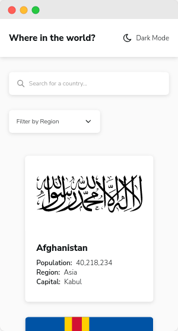

# Frontend Mentor - REST Countries API with color theme switcher solution

This is a solution to the [REST Countries API with color theme switcher challenge on Frontend Mentor](https://www.frontendmentor.io/challenges/rest-countries-api-with-color-theme-switcher-5cacc469fec04111f7b848ca). Frontend Mentor challenges help you improve your coding skills by building realistic projects. 

## Table of contents

- [Frontend Mentor - REST Countries API with color theme switcher solution](#frontend-mentor---rest-countries-api-with-color-theme-switcher-solution)
  - [Table of contents](#table-of-contents)
  - [Overview](#overview)
    - [The challenge](#the-challenge)
    - [Screenshot](#screenshot)
    - [Links](#links)
    - [Built with/](#built-with)
  - [Author](#author)

## Overview

### The challenge

Users should be able to:

- See all countries from the API on the homepage
- Search for a country using an `input` field
- Filter countries by region
- Click on a country to see more detailed information on a separate page
- Click through to the border countries on the detail page
- Toggle the color scheme between light and dark mode *(optional)*

### Screenshot  

### Links

- Solution URL: https://github.com/rndy28/rest-countries-api-viewer
- Live Site URL: https://resplendent-sopapillas-0d45f4.netlify.app
### Built with/

- ReactJS
- Typescript
- Styled-Components
- Flexbox
- Grid
- Mobile-first workflow
## Author
- Frontend Mentor - [@rndy28](https://www.frontendmentor.io/profile/rndy28)
- Twitter - [@rndyramadhan28](https://www.twitter.com/rndyramadhan28)
